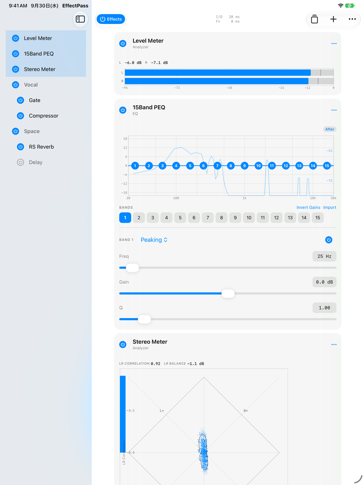
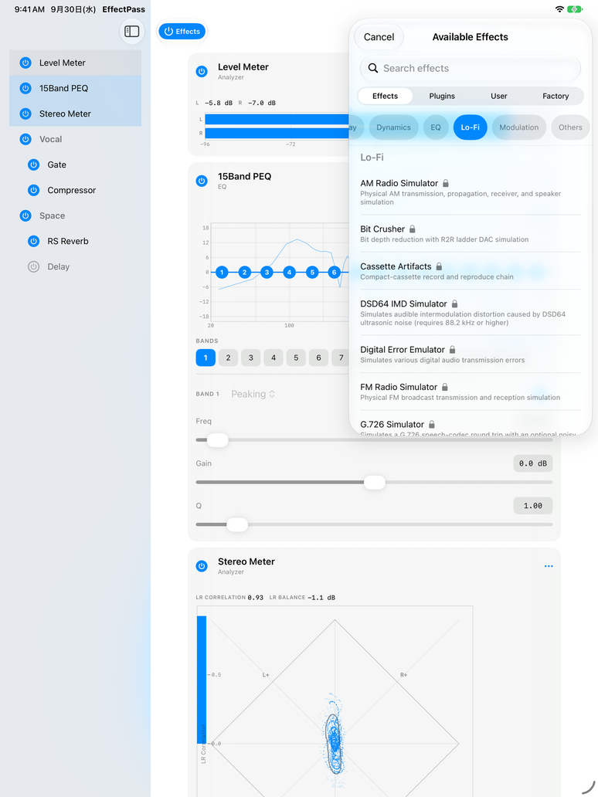
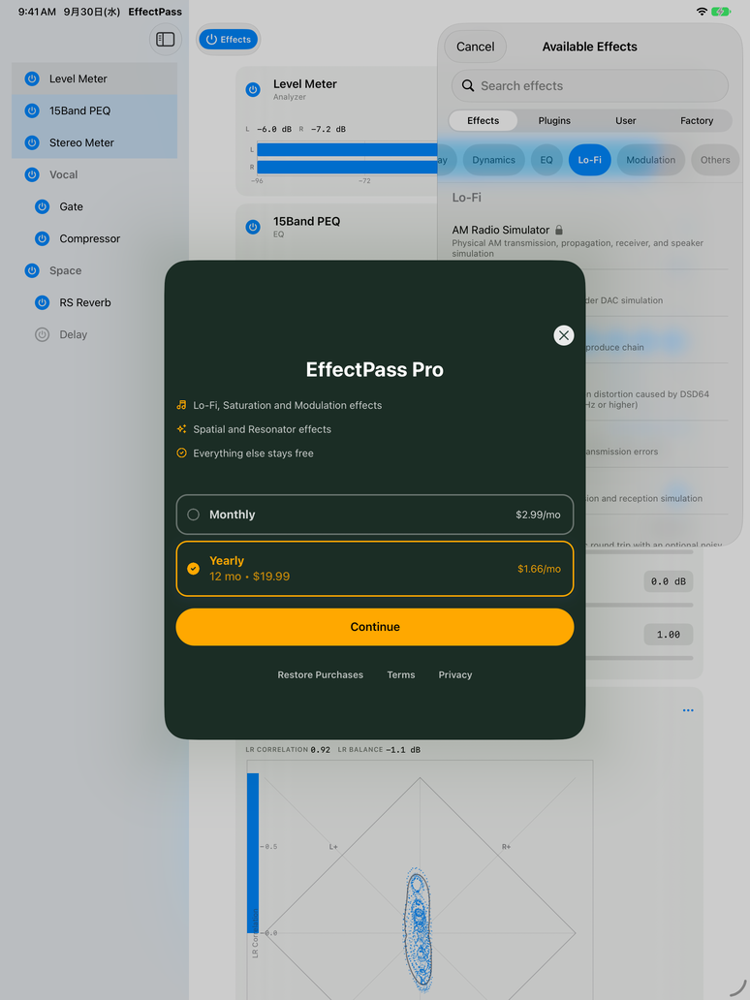

<div align="center">


&nbsp;&nbsp;&nbsp;&nbsp;


# EffectPass: a RevenueCat Shipaton 2026 experiment (not EffectDeck)

A separate experiment based on the open-source EffectDeck

</div>

> **EffectPass is not EffectDeck.** It is a separate, experimental app made for the
> RevenueCat Shipaton 2026 hackathon. It is built from the open-source code of
> [EffectDeck](https://github.com/satomasahiro2005/EffectDeck) to try out a subscription
> paywall. It is not an edition, a paid version or a "Pro" version of EffectDeck.
>
> **EffectDeck stays free and open source.** There are no plans to bring a subscription or
> any of these restrictions into EffectDeck.

<div align="center">

Demo video: https://youtu.be/lWddE7i7z8s

[](#building)

[](LICENSE)

<p>
  
  
  
</p>

</div>

> **Who made it.** EffectPass is made by nemut.ai, who also makes EffectDeck. It is **not
> affiliated with, endorsed by, or supported by
> [EffeTune](https://github.com/Frieve-A/effetune) or its author (Frieve-A / Yoshiyuki
> Kobayashi).** It bundles EffeTune's DSP core under the MIT license and says so.
>
> Send anything about EffectPass to nemut.ai (support@nemut.ai, or an issue on this
> repository), not to EffeTune and not to EffectDeck's issues or Discord.

**Effects for any player on your phone.** Anything with a transport in Control Center,
the Now Playing kind, goes through the chain: it takes that audio, runs it through
EffeTune's effects, and plays it on whatever was the output before you picked EffectPass:
the speaker, wired headphones, AirPods. No virtual cable, no input device to configure.
Pick **EffectPass** as the output in Control Center and that is the whole setup.

```
Spotify / a podcast app / Safari
  ↓ pick EffectPass as the output in Control Center
extension (Media Device Extension)   ← receives
  ↓ 127.0.0.1:47102
app                                  ← runs EffeTune's DSP
  ↓
the output you had before (speaker / headphones / AirPods)
```

## EffectPass Pro

EffectPass Pro is this hackathon app's own subscription tier. It has nothing to do with
EffectDeck: every effect listed below stays free in EffectDeck. The subscription is handled
by [RevenueCat](https://www.revenuecat.com/) (entitlement `pro`). Privacy:
[PRIVACY.md](PRIVACY.md).

**What Pro unlocks:** adding effects from five creative categories in the Effects picker:
Lo-Fi, Saturation, Modulation, Spatial and Resonator (50 of the 107 effects). Everything
else is free: EQ, dynamics, basics, reverb, delay, restoration, analyzers and the rest.
In the picker, locked effects have a lock icon, and tapping one opens the paywall.
Settings → About has a Pro section with the current status and Restore Purchases.

**What is not gated:** the gate only applies to adding a Pro effect from the Effects
picker. Chains, presets and share links that already contain Pro effects still load and
run, and factory presets are not gated. This is deliberate for the hackathon.

**Without an API key** (a build from source with no `Config/Secrets.xcconfig`), RevenueCat
is not configured. Nothing is locked, and the Pro section in Settings is hidden.

## If it says Unable to Connect

Almost always **Spotify with Canvas on.** Canvas is the short looping video behind some
tracks. While one plays, the session counts as video output, so iOS sends the route to
AirPlay instead of here, finds no receiver, and puts it back where it was. A track with
Canvas enabled cannot connect to EffectPass, and Spotify does not have to be on screen for
it. Turn Canvas off in Spotify's settings, then restart Spotify.

Spotify sometimes cannot connect even on a track without a Canvas: when Spotify has a video
(such as a Canvas) loaded, iOS treats it as playing video, even while paused. Restart
Spotify, then connect to EffectPass again.

Playing a YouTube video may disconnect EffectPass, depending on YouTube's playback state.
Restart YouTube, then connect to EffectPass again; the same video usually connects.

Otherwise, try these in order:

1. Restart the player app
2. Restart EffectPass
3. Restart the iPhone

The decision is made by iOS. None of the arguments `MediaOutputDevice` takes are read
when it is made, so there is nothing on this side to set.

## The iOS 27 Media Device Extension

iOS 27 added `MediaDevice.framework`, which lets an app present itself as an output
device the way an AirPlay speaker does. EffectPass advertises itself that way, and
once it is picked the system hands it the audio as samples.

It runs as two processes. The extension advertises the device and receives the audio;
the app processes it and plays it. They are split because the extension's sandbox denies
files, shared memory and `bind`. Outbound connections are allowed, so the audio goes over
a single TCP connection to the app. It ships as one app, and the user installs one app.

Signing the app itself with `com.apple.developer.media-device-extension` stops it from
opening an `AVAudioSession`: every category fails with `'!pla'`. The check only looks at
whether the entitlement's array is empty, so the app carries an empty array and the
extension carries the protocol identifier. That also gets past App Store Connect's
ITMS-91183.

To build an app like this, start from
[ios27-media-device-passthrough](https://github.com/satomasahiro2005/ios27-media-device-passthrough):
the same two processes in a handful of files, with a low-pass filter where EffectPass has
its effects. It is MIT-0, so you can copy it without keeping the copyright notice.

## Writing a JSFX for it

EffectPass hosts single-file audio JSFX through the portable EEL2 interpreter.
[`JSFX.md`](JSFX.md) is the contract: what is supported, what is
deliberately absent, the rules that reject a file outright, and the resource
limits. It is written to be handed to a language model as-is — the top section
states the requirements in the order they are usually violated, and there is a
checklist to run a generated script against before you try to import it.

EffectPass has no "with ChatGPT" buttons. The code it is based on has them, but the
documents they point ChatGPT at belong to EffectDeck and send you to EffectDeck, so they are
hidden here. You can still hand `JSFX.md` to a language model yourself. Import the file it
returns with **Import JSFX → From Files**, or copy the script and use **From Clipboard**.

The short version: one file, no `import` or `include()`, no filesystem, no MIDI,
`desc:` first, and no JIT — so keep `@sample` cheap.

It describes only the differences, not the language. For JSFX itself, read
REAPER's *JS: Programming Reference* and [JoepVanlier/ysfx](https://github.com/JoepVanlier/ysfx),
which is the interpreter embedded here.

A chain of the built-in effects is plain JSON. [`CHAIN.md`](CHAIN.md) describes the
format; the effect names and keys are generated for each EffeTune DSP version under
[`chain/`](chain/). Bring a chain in as the JSON code block with **Import from clipboard**
in Presets.

## Building

```bash
git clone https://github.com/satomasahiro2005/EffectPass-Shipaton2026-Experiment.git EffectPass
cd EffectPass
git submodule update --init Vendor/effetune Vendor/ysfx
bash Scripts/build.sh          # build and install on the attached device (no device? see Building for the simulator)
```

**RevenueCat key.** The key is read from `Config/Secrets.xcconfig`, which is not tracked:

```bash
cp Config/Secrets.xcconfig.example Config/Secrets.xcconfig
# then edit it and put your RevenueCat Test Store key (test_...) in RC_API_KEY
```

- Build **Debug** only with a Test Store key. RevenueCat calls `fatalError()` when a
  Release build starts with a `test_` key, so the app does not configure RevenueCat in
  Release with one.
- With no key, or an empty `RC_API_KEY`, everything is unlocked and the Pro section is hidden.
- Never commit the key. `Config/Secrets.xcconfig` is in `.gitignore`.
- The SDK is pulled in by Swift Package Manager (`RevenueCat` and `RevenueCatUI`,
  version pinned in `project.yml`). The first build needs network access.
- The Test Store needs a product for each package in the current offering and an
  entitlement named `pro` in the RevenueCat dashboard.
- In the simulator, buying goes through the Test Store: pick a plan, tap Continue, and choose
  "Test valid purchase" in the sheet that appears. Nothing is charged. The locks disappear
  right away, and Settings → About shows "EffectPass Pro — Active".
- On the simulator (no Media Device extension), `-ETMock 1 -ETSeed demo` gives a chain
  with a generated signal. On iPad, add `-ETLayout wide` for the two-column layout the demo
  video uses; see Launch arguments.

Leave out `--recursive`: ysfx's own submodules are not used. Keep the effetune submodule's
full history, not `--depth 1`, because `Tools/gen_version.py` reads its `dsp-v*` tag.

To open it in Xcode, generate first. The `.xcodeproj` is not tracked; `project.yml` is the
source.

```bash
bash Scripts/setup.sh
open EffeTuneLive.xcodeproj
```

You need:

- macOS with Xcode 27 or later
- A device running iOS 27 or later. The extension needs iOS 27, so no audio flows in the simulator
- Apple Developer Program membership (set `DEVELOPMENT_TEAM` in `project.yml` to yours)
- `xcodegen` and python3 3.10+ from Homebrew

The script finds the attached device. With more than one, use
`DEV_ID=<UDID> bash Scripts/build.sh`. The log goes to `build.log`; look for
`BUILD SUCCEEDED` there.

Run `Scripts/build.sh` from Terminal in the Mac's own login session, not over SSH. Over SSH
codesign cannot reach the keychain, and signing the extension fails with
`errSecInternalComponent`. The compile still succeeds, so an unsigned `out/EffectDeck.app`
appears and the install then fails with "not a valid bundle".

### Building for the simulator (no device, no Apple account)

This is the way to check that the source builds. It needs only a Mac with Xcode 27, and
no RevenueCat key: without one the app builds and runs with everything unlocked.

```bash
brew install xcodegen python@3.12        # once; python3 3.10+ must come first on PATH
git clone https://github.com/satomasahiro2005/EffectPass-Shipaton2026-Experiment.git EffectPass
cd EffectPass
git submodule update --init Vendor/effetune Vendor/ysfx
SKIP_XCODEGEN=1 bash Scripts/setup.sh    # patches the submodules, generates the catalog and models
python3 Tools/gen_sim_spec.py            # writes project-sim.yml, the project without the extension
xcodegen generate --spec project-sim.yml
xcodebuild -project EffeTuneLiveSim.xcodeproj -scheme EffeTuneLive   -configuration Debug -sdk iphonesimulator -arch arm64   CONFIGURATION_BUILD_DIR="$PWD/out-sim" build
```

The last line ends with `** BUILD SUCCEEDED **` and leaves `out-sim/EffectDeck.app`
(the product is still named `EffectDeck`, see **Names**). Install it with
`xcrun simctl install booted out-sim/EffectDeck.app`, then launch it with
`xcrun simctl launch booted ai.nemut.effectpass -ETMock 1 -ETSeed demo -ETLayout wide`.
`Scripts/setup.sh` needs the submodules in place first; the simulator has no
`MediaDevice.framework`, so the extension is left out and no audio flows. The first build
downloads the RevenueCat SDK, so it needs network access.

### Building under your own Apple ID

Set `DEVELOPMENT_TEAM` in `project.yml` to your team, change the identifiers below to your
own, and create them in the Apple Developer portal.

| What | Today's value | Where it is written |
|---|---|---|
| App ID for the app | `ai.nemut.effectpass` | `project.yml` (`EffeTuneLive` target) |
| App ID for the Media Device extension | `ai.nemut.effectpass.extension` | `project.yml` (`EffeTuneLiveExtension`) |
| App ID for the share extension | `ai.nemut.effectpass.share` | `project.yml` (`EffectDeckShare`) |
| Media Device Sharing Extension identifier | `media-device-protocol.ai.nemut.effectpass` | `Sources/Extension/Extension.entitlements`, `UTExportedTypeDeclarations` in `Sources/Extension/Info.plist`, and `kProtocolID` in `Sources/Extension/EffeTuneLiveExtension.swift` |
| App Group | `group.ai.nemut.effectpass` | all three `.entitlements` files and `ETShareInbox.group` in `Sources/EffeTuneLive/DSP/ETShareInbox.swift` |
| iCloud key-value storage | follows the app's bundle ID | `Sources/EffeTuneLive/EffeTuneLive.entitlements` |

- The Media Device Sharing Extension identifier is made under Identifiers > new. There is
  no review. The entitlement value must be an array with one element; a bare string stops
  the extension from launching. Change all three places together: the extension offers
  `kProtocolID` as its protocol type, and it must match the entitlement.
- `Tools/check_release_binary.py` checks a release archive against EffectDeck's values
  (`BUNDLES`, `APP_GROUP` and `APPLINKS` at the top of the file). EffectPass has not
  updated them, so change them there before you use it on an EffectPass archive.
- The app itself carries `com.apple.developer.media-device-extension` as an **empty**
  array. Leave it empty (see **The iOS 27 Media Device Extension** above).
- Enable App Groups on all three App IDs and iCloud (key-value storage only) on the app.
- EffectPass does not claim any Associated Domains and does not make `effectdeck.nemut.ai`
  links (that is EffectDeck's website). Sharing a chain from EffectPass makes an EffeTune
  web link only. Share links from `effectdeck.nemut.ai` open in EffectDeck or in the
  browser, not in EffectPass.
- The release scripts (`Scripts/ship.sh`, `Scripts/notarize.sh`, `Scripts/adp_fetch.sh`,
  `Tools/asc*.py`, `Tools/adp_place.py`, `Tools/watch_testflight.sh`) come from EffectDeck and
  still name EffectDeck's App Store Connect app. EffectPass is not on the App Store or
  TestFlight and does not use them.

## Working on the code

### Names

The app is **EffectPass**. Its code comes from EffectDeck, a separate free app, and the
project files still carry names from there: `EffeTuneLive.xcodeproj`, the `EffeTuneLive`
app target, `EffeTuneLiveExtension`, `Sources/EffeTuneLive`, and the app target's product
name `EffectDeck` (so the build folder is `EffectDeck.app`). These leftover internal names
all refer to EffectPass in this repository; on the device the app is named EffectPass and
has its own bundle ID (`ai.nemut.effectpass`). Much of `docs/` was written for EffectDeck
before EffectPass was split off; issue numbers there refer to EffectDeck's tracker.
"EffeTune" alone means the upstream project in `Vendor/effetune`.

### What is pinned and patched

| Path | What it is |
|---|---|
| `Vendor/effetune` | EffeTune, pinned by the submodule. Its `dsp/` is the audio engine |
| `Vendor/ysfx` | ysfx, the JSFX interpreter, pinned to `5c3452fe`. `Scripts/setup.sh` refuses another revision |
| `Patches/abi-begin-ptr.diff` | Adds `et_instance_asset_begin_ptr`, a 64-bit staging pointer. Without it the seven effects that load data (IR Reverb and the ones designed in the app, such as Room EQ) pass audio through silently |
| `Patches/effetune-external-*.diff` | Let AUv3 and JSFX run as nodes inside the EffeTune chain ([docs/external-processor.md](docs/external-processor.md)) |
| `Patches/ysfx-effectdeck-ios.diff` | The iOS sandbox for ysfx and fixes taken from upstream WDL |
| `Patches/ysfx-effectdeck-ios.old.diff` | The previous ysfx patch. Never applied; setup.sh uses it to take the old version off a copied tree |

`Scripts/setup.sh` applies the patches to the submodule working trees, regenerates the
effect catalog and presets from `Vendor/effetune`, and runs xcodegen. The patched
submodule trees are never committed; the patches are. [`docs/`](docs/README.md) lists the
design documents and notes.

### Tests

None of these need a device or a paid account. [CONTRIBUTING.md](CONTRIBUTING.md#running-the-tests)
has the exact commands.

| Suite | Runs on | Command |
|---|---|---|
| Logic tests (all of `Tests/Unit`, JSFX included) | Mac with Xcode, simulator | `bash Scripts/test.sh`, or the `Logic` scheme in Xcode |
| The Foundation-only part of the Logic tests | Linux or WSL with Swift | `bash Tests/Linux/run.sh --name local` |
| Native C tests (`Tests/Native`) | Linux, macOS or WSL with CMake | `cd Tests/Native && cmake --preset asan && cmake --build --preset asan && ctest --preset asan` |
| Generators and checks (`Tools/`, `Tests/Tools`) | Python 3.10+ and Node 22, any OS | `python3 -m unittest discover -s Tests/Tools` |
| UI tests (`Tests/UI`) | Mac with Xcode, simulator | `bash Scripts/uitest.sh MenuProbe` (one class; see CONTRIBUTING) |

GitHub Actions runs all of them but the UI tests, and checks that generated files are up to
date, on every push to `main` and every pull request ([CI](CONTRIBUTING.md#ci)).

### Launch arguments

For the simulator and for debugging. They are read from `UserDefaults`, so they are passed
as `-Name value` to `xcrun simctl launch`, `xcrun devicectl device process launch` or an
XCUITest `launchArguments`. The icon on the home screen passes none.

| Argument | What it does |
|---|---|
| `-ETSeed <name>` | Starts with a prepared chain instead of the saved one, every card open. `none`, `peq`, `compressor`, `saturation`, `meter`, `spectrum`, `peq-spectrum`, `chain`, `store`, `analyzers4`; a factory preset by short name (`vinyl`, `karaoke`, `analyzers`, `live`, `tube`, `bbe`, `fmradio`); `demo`, `pv-open`, `pv-montage`, `pv-rack` (demo video chains) in Debug builds; anything else is read as plugin type names separated by commas |
| `-ETMock 1` | Feeds a generated test signal, so meters and graphs move without the extension |
| `-ETMockFile <path>` | With `-ETMock 1`, plays that audio file instead (decoded to the engine rate). `-ETMockStart <s>` starts it at that position, `-ETMockLoop 0` plays it once, `-ETMockMarker <path>` writes the Unix time the engine started (when the `-ETMockStart` position plays) |
| `-ETWidth <pt>` | With `-ETSeed`, the width of the one-column chain, so screenshots taken on iPad look like a phone. Default 393; `0` keeps the device width |
| `-ETLayout wide` | With `-ETSeed`, keeps the two-column iPad layout instead of one column |
| `-ETHideOff 1` | Debug builds, two columns: the right column leaves out effects that are switched off (the left list keeps them). For the demo video's one-effect-per-bar montage |
| `-ETCollapsed 1` | With `-ETSeed`, starts with every card closed. A card with a graph still shows the graph |
| `-ETSheet <name>` | Opens a sheet at launch: `picker`, `settings`, `routing`, `presets`, `ir`, `tips` |
| `-ETAutoExpand 1`, `-ETAutoExpandIndex <n>` | Taps an effect once, 4 seconds after launch, to record the animation. A tap moves the card one step (open → graph only → folded → open), so it opens only a folded card, and a card that `-ETSeed` opened keeps only its graph. The first effect by default; `n` counts from 0 and skips Sections |
| `-ETDebugBlocks 1` | Tints each Section block to check grouping |
| `-ETDiag 1` | Adds a hidden `diag` text with the active node count and chain length, for UI tests |
| `-ETConsole 1` | Also prints the diagnostic log to stdout, for `devicectl ... --console` |
| `-ETNowPlaying on\|off\|first` | Whether the app claims Now Playing (default `off`). Debug builds save it to `UserDefaults` and keep it on later launches until another value is passed; Release builds use it for that launch only |
| `-ETProbe 1` | Shows the reorder probe screen instead of the app |
| `-pref.<key> <value>` | Overrides a setting for that launch, for example `-pref.power balanced` |

## License

The source code is open source under the [MIT license](LICENSE). Everything bundled in the
app is open source too; [NOTICE.md](NOTICE.md) lists each part and its license.
